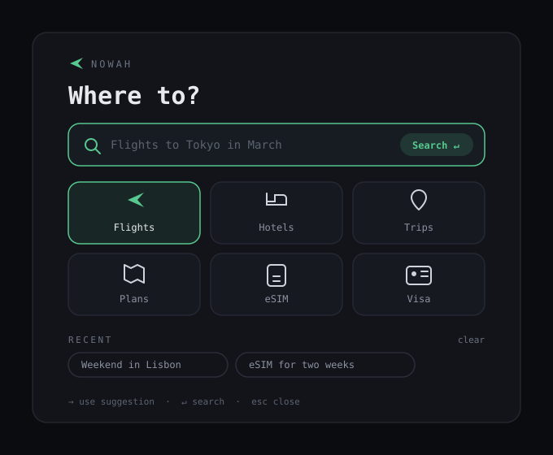

# Nowah for Omarchy

An [Omarchy](https://omarchy.org) shell plugin for [Nowah](https://app.nowah.xyz), the AI travel booking app. A Nowah button in the bar opens a "Where to?" panel: type anything — flights, hotels, itineraries — and it opens in a dedicated Nowah app window with the search already running.

<p align="center">
  
</p>

## Features

- **AI travel search** — Enter opens the Nowah app window with your query running through the AI chat
- **Quick-link tiles** — Trips, Plans, eSIM, and Visa deep-link straight into the app; Flights and Hotels seed the search box
- **Rotating suggestions** — example queries cycle in the placeholder; press `→` to use one, `↓` for the next
- **Recent searches** — your last few queries persist as one-click pills (toggle in plugin settings)
- **Theme-native** — every color derives from your active Omarchy theme
- **Scriptable** — IPC target `xyz.nowah.travel` with `toggle`, `open`, `close`, and `search`

All real flows (results, booking, payment, sign-in) run in the Nowah web app via `omarchy-launch-webapp` — nothing is re-implemented in the shell.

## Install

```bash
omarchy plugin add https://github.com/maslinedwin/nowah-travel --enable
```

Or from the Omarchy menu: **Setup > Plugins**.

To remove:

```bash
omarchy plugin remove xyz.nowah.travel
```

The plugin stores only your recent searches (in the shell's own `shell.json`, removable with "clear" in the panel) and has no external dependency beyond `omarchy-launch-webapp` (part of Omarchy), which opens the app in a Chromium-family browser window.

## Usage

- **Left click** the bar icon — open the search panel (`↵` search, `→` use suggestion, `esc` close)
- **Right click** — open the Nowah app window directly
- **Flights / Hotels tiles** — seed the search box; **Trips / Plans / eSIM / Visa** — deep-link into the app

### Global hotkey

Summon the panel from anywhere by adding a Hyprland binding:

```ini
# ~/.config/hypr/bindings.conf
bindd = SUPER SHIFT N, Nowah, exec, omarchy-shell shell toggle xyz.nowah.travel
```

### Settings

In **Setup > Plugins > Nowah**: toggle recent searches and the rotating example queries.

## Requirements

Omarchy 4.0 "Quattro" or later (the Quickshell-based shell with plugin support).

## Develop locally

```bash
git clone https://github.com/maslinedwin/nowah-travel ~/.config/omarchy/plugins/xyz.nowah.travel
omarchy-shell shell rescanPlugins
omarchy-shell shell setPluginEnabled xyz.nowah.travel true
```

Edits under `~/.config/omarchy/plugins/` hot-reload automatically. Lint and validate with:

```bash
qmllint -I "$OMARCHY_PATH/shell" BarWidget.qml Panel.qml
omarchy plugin validate ~/.config/omarchy/plugins/xyz.nowah.travel
```

## License

MIT — see [LICENSE](./LICENSE).
